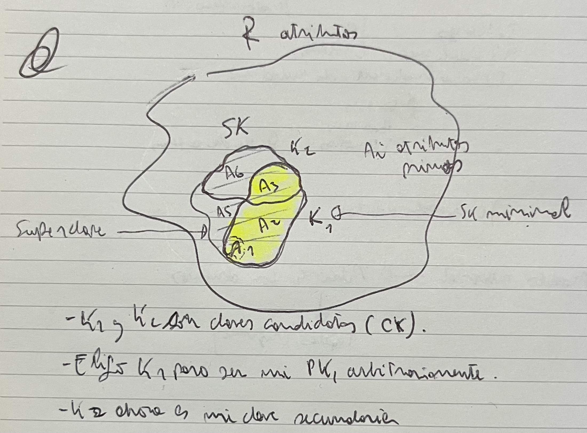

## Referencias
- [Curso de dbs en CMU](https://15445.courses.cs.cmu.edu/fall2019/schedule.html)

## Notas sobre temas que no pienso darle mucha bola

### Objetos

Existe un dialecto de SQL en el cual se permite modelar:
1. tipos no atómicos (sets, listas, etc)
2. tipos complejos, para ser usados dentro de relaciones
3. herencias
4. otras cosas del paradigma objetos

> Mapeo objeto relacional. Qué tiene que ver aca?

### XML
No mucho que decir. Se ve que XML, para que cumple, DTDs y XMLSchema. Después XPATH y alguna otra cosita más. Pero ni ahí creo que entre en el final.

## Resumen clases

1. Transacciones
    1. Qué es una transacción y propiedades deseables
1. Schedules - 763
    1. Definición formal de una transacción e historias
    1. Seraiabilidad
    1. Tipo de historias
1. Control de concurrencia - 781
    1. Mecanismos de locking como 2pc, multiversion, timestamps, etc.
1. Logging
    1. Que se escribe en el log, y cómo funciona el recovery subsystem

## Introducción

Bases de datos, algunas definiciones:
- Colección de datos relacionados y organizados.
- Colección lógicamente coherente de datos con un signficado que depende de su dominio de aplicación.

DBMS (database management system): Software para el manejo y administración de bases de datos.

> Qué funcionalidades proveen? Taxonomía?

MER: Modelo entidad relación Representa entidades del mundo real y relaciones entre ellas. Consiste en el diseño o planificación de una base de datos.

DER: Diagrama entidad relación Herramienta pra visualizar un MER.

Pasos para construir un MER:
1. Identificar entidades
1. Identificar atributos para entidades. Estos pueden ser simples, compuestos, derivados o multivaluados.
1. Identificar las claves en cada entidad
1. Identificar relaciones. Estas pueden ser unarias, binarias o ternarias. Además, cada uno puede ser total o parcial. Además, en el caso de las relaciones ternarias, estas pueden poseer atributos.
1. Cardinalidad de las relaciones.
1. Entidades débiles.

Un MER puede ser expresado como un modelo relacional. En este, una entidad con sus atributos son repsentados como una **relación**, donde cada instancia es llamada una tupla.

> Sobre estas relaciones, tuplas y atributos son sobre las que están definidos los lenguajes de consulta.

## Lenguajes de consulta
### AR: Algebra relacional

Lenguaje imperativo (explícito) sobre un modelo relacional. Permite expresar consultas sobre estos. Contruído como si el modelo relacional y sus operaciones definieran un álgebra (también llamado álgebra relacional).

> TODO: Hacer resumen de las operaciones, con algún ejemplito, para tener una idea del poder de expresividad que tiene.

### CRT: Cálculo relacional de tuplas

Lenguaje declarativo que permite expresar cómo es el conjunto de respuestas que buscamos. SQL tiene sus bases fundacionales en este.

Las fórmulas tienen la siguiente estructura básica: 
$
{t | COND(t) }
$
Dónde $COND$ pueden ser expresiones de lógica de primer orden sobre tuplas de relaciones. $t$ es una tupla que prepresenta las tuplas resultado.

> Las slides tiene un descripción concisa del lenguaje, y después son puro ejercicio.

### Sobre expresividad

La **expresividad** de un lenguaje de consulta equivale al conjunto de conuslta que se le pueden hacer a una base de datos por medio de este lenguaje.

**CRT vs LPO**
CRT es una especialización de LPO. Una relación puede ser pensada como un predicado que indica si una instancia se encuentra o no en la base de datos.

CRT con expresiones seguras, o safe-CRT: CRT restringido a expresiones donde se garantiza que solo producen una cantidad finita de tuplas como resultado.

**AR vs CRT** 
Bajo la condición de safe-CRT, tienen el mismo poder expresivo.

> LPO no tiene poder expresivo suficiente, por ejemplo si nuestro modelo fuera un grafo de vuelos de una aerolinea, y quisieramos consultar `es posible viajar de x hacia y?`

**Y con SQL?**
La semántica de SQL está basada en safe-CRT, por lo que a priori tiene el mismo poder expresivo que ART y safe-CRT.

## Normalización

Almacenar un modelo como **natural joins** introduce problemas conocidos como anomalías de actualización, estas pueden ser de inserción, deleción y modificación.

Una dependencia funcional es una propiedad semántica del modelo. Estas se escriben $X \rightarrow Y$, y quiere decir que los valores que toman los atributos en $Y$ dependen de los valores que tomen los atributos en $X$.
Más formalmente, si dentro del conjunto de DFs se encuentra $X \rightarrow Y$, esto implica que para dos tuplas $t_1, t_2$ cualesquiera tal que $t_1[X] = t_2[X]$, se debe cumplir $t_1[Y] = t_2[Y]$.

**Definiciones pegadas del libro**

Básicamente **relation schema**, o esquema de relación denota a la estructura $R(A_1, A_2, ..., A_n)$. Esta es considerada el "esquema" de la relación, el prototipo. Dentro de un esquema $R$, se pueden tener **relation states**, o **estado** a secas.
Se denotan como $r(R)$.
Estos son un conjunto $\{t_1, t_2, ..., t_m\}$ de $m$ tuplas. Cada una de estas representa una instancia del esquema $R$. Es decir, una valuación de cada atributo $A_i$.

> Libro página 151

De aqui suerge el concepto de estado legal (o **legal relation state**). Dado un conjunto $F$ de dependencias funcionales (DFs), se dice que un estaod $r(R)$ es legal si cumple toda las DF $f \in F$. 
Recordar que **cumplir o validar** una DF es una propiedad semántica, ua que depende del significado de los atributos.

**Claves**

Sea una relación $R=\{A_1, A_2, ..., A_n\}$. Sea **S** un subconjunto de ellos, entonces se dice que S es una super clave (SK) de R si 
$
\not\exists t_1, t_2 ( t_1 \neq t_2 \land legal(t_1) \land legal(t_2) \land t_1(S) = t_2(S) )
$

Dicho de otra forma, si $t_1$ y $t_2$ son dos tuplas legales de la relación, y sus atributos dentro de $s_i \in S$ cumplen que $t_1(s_i) = t_2(s_i)$ entonces $t_1=t_2$.

Diferentes tipos de claves:
- Clave (K): Superclave minimal. Si remuevo un atributo deja de ser superclave.
- Clave candidata (CK): Cada una de las claves de un esquema.
- Clave primaria (PK): $k \in CK$ designada arbitrariamente como primaria.
- Clave secundaria: $k \in CK / k \neq PK$

> Un atributo primo es un atributo $A_i$ de un esquema, que pertence a alguna CK

### Formas normales

Para todas las definiciones de formas normales, asumir en esquema de relación $R=\{A_i\}, i=1,2,...,n$, con una clave primaria $PK$

Recordar que al aplicar el paso de descomposición de cualquier forma normal, debe poder re-armarse el esquema por medio de un **natural join**.

**1FN**

$\forall A_i \in R, Dom (A_i) atomico$

> TODO: resumir formas normales

## NoSQL

La definición real de la sigla es _not just SQL_.

**Características generales**

- Schemaless: Fueron diseñadas tomando en cuenta la existencia de datos no/semi estructurados.
- No relacionales
- Distribuidas!
- Escala de forma horizontal
    - Sharding
- Interfaces sencillas para acceder a los datos (SQL sería un mencanismo complejo, por la capaidad de expresión)
- Soportan grandes volúmenes de datos

> TODO: Según las diapos se utiliza a travéz de todas un esquema de tipo clave valor. Es cierto para cada categoría de NoSQL?

Al surgir este tipo de bases de datos, también surge el concepto de propiedades **BASE**, las cuales difieren de **ACID**. Estás son:
- Basic availability (BA)
- Soft-State (S)
- Eventual Consistency (E)

> TODO: Investigar BASE vs. ACID

Las propiedades de BASE y ACID son propiedades que aplican al concepto de interacción de un usuario con la base de datos. En el caso de ACID, la interacción es transaccional, y **generalmente se piensa contra una sola instancia de una DB**. En cambio, como las bases NoSQL suelen ser distribuidas, se piensa BASE como propiedades que ofrece el sistema como un todo.

> TODO: Releer ver algún videíto de CAP theorem, y como aplica ahora?

- CAP: A system can at most provide two of these three. Since a distributed system always have to be partition torance, the trade-off is between C and A.
    - Consistency: A reader gets the most recent value on a READ.
    - Availability: Every request receives a response.
    - Partition tolerance: System continues to operate if there's a portion of the system unhealthy.

### Taxonomía
- NoSQL
    - Key Value Stores: Cada item almacenado es un par clave valor. El valor puede ser de tipo texto plano, documentos JSON/XML, hasta blobs.
        - Redis
    - Document stores: También respetan un esquema clave valor, pero los valores están restringidos a ser documentos de texto con cierta estructura (JSON/XML). Siguen siendo schemaless, pero como poseen metadata sobre los documentos almacenados, permiten realizar indexaciones sobre algunos de los campos.
        - MongoDB
    - Column Family DBs: Son bases de datos que consisten una columnas de datos relacionados. Un par clave valor puede ser pensado como una serie de columnas que compartes una clave en particular. Ofrecen naturalmente partición vertical (en vez de particionar los datos por conjuntos de items, se particionan por conjuntos de atributos). Los valores podrían ser vistos como una analogía a las _vistas_ de las bases de datos relacionales.
        - Google BigTable
    - Graph databases: Almacena los datos como nodos conectados por medio de relaciones dirigidas y tipadas. Permite realizar consultas de ese tipo.
        - Neo4j

**Pros**
- Soportan grandes volúmenes de datos.
- El mecanismo para escalar el sistema es más simple.

**Cons**
- No hay ninún tipo de inteo
gridad referencial a travez de diferentes items.

## Optimización

### Índices

Facetas para clasificar un índice: primary o secondary, clustered o unclustered, si usa block anchors o no, denso o esparso.

- Denso e esparso: Si tiene o no una entrada por cada `search key value`, es decir, por cada record.

**Primary Index**
Archivo ordenado construido para acceder eficientemente a un data file, el cual se encuentra ordenado por una ordering key. Es decir, el íncide "indexa" sobre el mismo atributo por el cual están ordenados los records en disco. Esta es llamada **primary key**. Cada entrada del índice tiene la forma `<K(i), P(i)>`. `K(i)` es del tipo de la primary key, y `P(i)` es un puntero a un bloque en el disco. Existe una entrada por cada bloque en disco que ocupa el archivo de la relación, y cada `K(i)` corresponde a la PK de la primera entrada del bloque `i` (también llamado **anchor record**, o **block anchor**). Es **esparso**, ya que tiene una entrada por cada bloque, y no por cada record.

> A pesar que esté ordenado el índice por la misma clave que el data file de la relación, como el índice puede ser contenido en una cantidad mucha mas chica de bloques que el data file entero, realizar una busqueda binaria sobre el mismo es mucho menos costoso que sobre el archivo de relación en si.

Problema: Inserción y borrado requieren mover elementos entre bloques.

**Clustering index**

Un clustering index es usado cuando las tuplas de una relación están físicamente ordenadas por una atribuo no clave (llamado **clustering field**, y correspondientemente **clustered file**). En este tipo de índices hay una entrada por cada valor distinto del clustering field. Dicha entrada apunta al primer bloque del data file que tiene ese valor en el clustering field. Es **esparso**.

**Secondary Index**

Proveen un patrón de acceso secundario a una relación que ya tenía un primario. El data file subyacente puede estar ordenado o no, o hasheado. Básicamente como todos los otros es un archivo ordenado de tuplas. 
Este tipo de índices tiene dos categorías:

- Es creado sobre una clave candidata. En dicho caso va a haber una entrada del índice por cada tupla de la relación. En el lado izquierdo estará un valor úncio del indexing field, y en el lado derecho o un puntero a la tupla directamente, o un puntero al bloque donde esta tupla debe ser buscada. Notar que acá no se pueden usar block anchors, ya que las tuplas no están __ƒísicamente__ ordenadas por el indexing field.

> Un puntero a una tupla (record pointer) son usados cuando el índice es denso. Pueden ser implementados como un puntero al block anchor + el offset dentro del bloque.

- Es creado sobre un atributo no-clave, no-ordering. En este caso pueden haber muchas tuplas con el mismo valor en ese atributo. Para atacar este problema, existen muchas alternativas en cuanto a la implementación:
    - Incluir entradas duplicadas en el índice, de la forma `(value_1, tuple_n), (value_1, tuple_m), ..., (value_1, tuple_j)`
    - Cada entrada del índice puede tener un tamaño variable, incluyendo una lista de tuplas con dicho valor en el indexing field
    - Usar un índice con un nivel de indirección, básicamente como un two-level-paging system. Una entrada del índice con la pinta `(v, p)` le podrían corresponder más de una tupla cuyo atributo indexado tiene valor `v`. Estas son guardadas en una tabla ubicada en el bloque `p`, donde cada entrada es o un puntero a la tupla, o al bloque que la contiene.

> Se llaman índices secundarios porque la relación sobre la cual se crean ya poseía un patrón de acceso primario (un índice).

> Los secondary index consumen muhca memoria y son más lentos que un primary, pero como en caso que no existieran habría que realizar una linear search, estos proveen una mejora sustancial.

> TODO: Ver algo de BTrees

**Hash index**

Se usa una estructura secundaria que usa el hash del atributo indexado como clave de acceso. Una vez obtenido el hash, se accede a un bucket donde se guardan tuplas de la forma `(v1, p1), (v2,p2), ...` donde $H(v_1) = H(v_2) = BucketHash$, y cada entrada guarda el puntero a la tupla o al bloque que la contiene el atributo $v_i$.

**Indices en múltiples claves**

Si múltiples atributos están involucrados en una única query es posible utilizar alguno de los índices existentes. Por ejemplo en una query sobre dos atributos A y B, se podría utilizar un índice sobre A o B, y ambos y luego tomar la interesección de los resultados en una query WHERE-equals.

A una clave de un índice que tiene muchos atributos se la llama **composite key**. Se puede contruir índices que trabajan con composite keys, por ejemplo:
- Alguno de los índices antes visto donde en vez de tomarse como clave un sólo atributo, se usa la la conjunción de ellos, y orden lexicográfico.
- Partitioned hashing: Una función de hash que podruce n direcciones de hash para n atributos de la composite key, y se concatenan. Esto permite que se puede buscar en este mismo índice con igualdad sobre uno solo de los atributos.
- Grid files: Se contruye una estructura con forma de tabla n-dimensional, en la cual por aca atributo se usa una escala pre-definida de forma de que las tuplas queden equidstribuidas entre los niveles de la escala.

> TODO: Agregar detalles u ordenar la información en alguna tabla

### Query execution

Una query es primero descompuesta en **query blocks** para que no haya queries anidadas. Un query block es un bloque __sin anidaciones__ que tiene un `SELECT-FROM-WHERE (+GROUP BY) (+HAVING) (+AGGREGATE)`. Si tiene una query anidad o se extrae para ser optimizada/ejectuada aparte, o de ser posible, es reemplazada por un antijoin (`WHERE NOT IN`) o semijoin (`WHERE IN`).

Luego es traducida de su forma de alto nivel (SQL) a un query tree expresado en un álgebra relacional extendida.

#### SELECT - $\sigma_{A=v}(RELACION)$

Un select es básicamente una operación para seleccionar las tuplas que cumplen cierta condición.

> TODO: Ver si tiene sentido hacer resumend de las operaciones y sus algos. Quizás en alguna tabla

## [Distribuidas](./distribuidas.md)