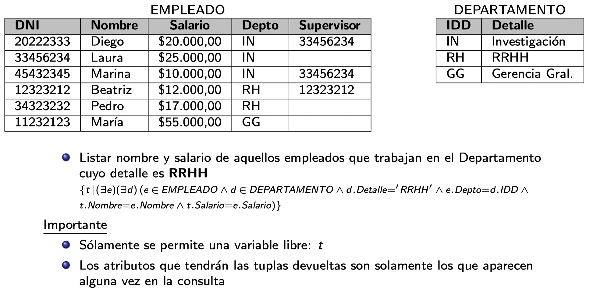

## Referencias
- [Curso de dbs en CMU](https://www.youtube.com/watch?v=oeYBdghaIjc&list=PLSE8ODhjZXjbohkNBWQs_otTrBTrjyohi&ab_channel=CMUDatabaseGroup)

## Notas sobre temas que no pienso darle mucha bola

### Objetos

Existe un dialecto de SQL en el cual se permite modelar:
1. tipos no atómicos (sets, listas, etc)
2. tipos complejos, para ser usados dentro de relaciones
3. herencias
4. otras cosas del paradigma objetos

> Mapeo objeto relacional. Qué tiene que ver aca?

### XML
No mucho que decir. Se ve que XML, para que cumple, DTDs y XMLSchema. Después XPATH y alguna otra cosita más. Pero ni ahí creo que entre en el final.

## Resumen clases

1. Transacciones
    1. Qué es una transacción y propiedades deseables
1. Schedules - 763
    1. Definición formal de una transacción e historias
    1. Seraiabilidad
    1. Tipo de historias
1. Control de concurrencia - 781
    1. Mecanismos de locking como 2pc, multiversion, timestamps, etc.
1. Logging
    1. Que se escribe en el log, y cómo funciona el recovery subsystem

## Introducción

Bases de datos, algunas definiciones:
- Colección de datos relacionados y organizados.
- Colección lógicamente coherente de datos con un signficado que depende de su dominio de aplicación.

DBMS (database management system): Software para el manejo y administración de bases de datos.

> Qué funcionalidades proveen? Taxonomía?

MER: Modelo entidad relación Representa entidades del mundo real y relaciones entre ellas. Consiste en el diseño o planificación de una base de datos.

DER: Diagrama entidad relación Herramienta pra visualizar un MER.

Pasos para construir un MER:
1. Identificar entidades
1. Identificar atributos para entidades. Estos pueden ser simples, compuestos, derivados o multivaluados.
1. Identificar las claves en cada entidad
1. Identificar relaciones. Estas pueden ser unarias, binarias o ternarias. Además, cada uno puede ser total o parcial. Además, en el caso de las relaciones ternarias, estas pueden poseer atributos.
1. Cardinalidad de las relaciones.
1. Entidades débiles.

Un MER puede ser expresado como un modelo relacional. En este, una entidad con sus atributos son repsentados como una **relación**, donde cada instancia es llamada una tupla.

> Sobre estas relaciones, tuplas y atributos son sobre las que están definidos los lenguajes de consulta.

## Lenguajes de consulta
### AR: Algebra relacional

Lenguaje imperativo (explícito) sobre un modelo relacional. Permite expresar consultas sobre estos. Contruído como si el modelo relacional y sus operaciones definieran un álgebra (también llamado álgebra relacional).

> TODO: Hacer resumen de las operaciones, con algún ejemplito, para tener una idea del poder de expresividad que tiene.

### CRT: Cálculo relacional de tuplas

Lenguaje declarativo que permite expresar cómo es el conjunto de respuestas que buscamos. SQL tiene sus bases fundacionales en este.

Las fórmulas tienen la siguiente estructura básica: 
$
{t | COND(t) }
$
Dónde $COND$ pueden ser expresiones de lógica de primer orden sobre tuplas de relaciones. $t$ es una tupla que prepresenta las tuplas resultado.

> Las slides tiene un descripción concisa del lenguaje, y después son puro ejercicio.

### Sobre expresividad

La **expresividad** de un lenguaje de consulta equivale al conjunto de conuslta que se le pueden hacer a una base de datos por medio de este lenguaje.

**CRT vs LPO**
CRT es una especialización de LPO. Una relación puede ser pensada como un predicado que indica si una instancia se encuentra o no en la base de datos.

CRT con expresiones seguras, o safe-CRT: CRT restringido a expresiones donde se garantiza que solo producen una cantidad finita de tuplas como resultado.

**AR vs CRT** 
Bajo la condición de safe-CRT, tienen el mismo poder expresivo.

> LPO no tiene poder expresivo suficiente, por ejemplo si nuestro modelo fuera un grafo de vuelos de una aerolinea, y quisieramos consultar `es posible viajar de x hacia y?`

**Y con SQL?**
La semántica de SQL está basada en safe-CRT, por lo que a priori tiene el mismo poder expresivo que ART y safe-CRT.

## Normalización

Almacenar un modelo como **natural joins** introduce problemas conocidos como anomalías de actualización, estas pueden ser de inserción, deleción y modificación.

Una dependencia funcional es una propiedad semántica del modelo. Estas se escriben $X \rightarrow Y$, y quiere decir que los valores que toman los atributos en $Y$ dependen de los valores que tomen los atributos en $X$.
Más formalmente, si dentro del conjunto de DFs se encuentra $X \rightarrow Y$, esto implica que para dos tuplas $t_1, t_2$ cualesquiera tal que $t_1[X] = t_2[X]$, se debe cumplir $t_1[Y] = t_2[Y]$.

**Definiciones pegadas del libro**

Básicamente **relation schema**, o esquema de relación denota a la estructura $R(A_1, A_2, ..., A_n)$. Esta es considerada el "esquema" de la relación, el prototipo. Dentro de un esquema $R$, se pueden tener **relation states**, o **estado** a secas.
Se denotan como $r(R)$.
Estos son un conjunto $\{t_1, t_2, ..., t_m\}$ de $m$ tuplas. Cada una de estas representa una instancia del esquema $R$. Es decir, una valuación de cada atributo $A_i$.

> Libro página 151

De aqui suerge el concepto de estado legal (o **legal relation state**). Dado un conjunto $F$ de dependencias funcionales (DFs), se dice que un estaod $r(R)$ es legal si cumple toda las DF $f \in F$. 
Recordar que **cumplir o validar** una DF es una propiedad semántica, ua que depende del significado de los atributos.

**Claves**

Sea una relación $R=\{A_1, A_2, ..., A_n\}$. Sea **S** un subconjunto de ellos, entonces se dice que S es una super clave (SK) de R si 
$
\not\exists t_1, t_2 ( t_1 \neq t_2 \land legal(t_1) \land legal(t_2) \land t_1(S) = t_2(S) )
$

Dicho de otra forma, si $t_1$ y $t_2$ son dos tuplas legales de la relación, y sus atributos dentro de $s_i \in S$ cumplen que $t_1(s_i) = t_2(s_i)$ entonces $t_1=t_2$.

Diferentes tipos de claves:
- Clave (K): Superclave minimal. Si remuevo un atributo deja de ser superclave.
- Clave candidata (CK): Cada una de las claves de un esquema.
- Clave primaria (PK): $k \in CK$ designada arbitrariamente como primaria.
- Clave secundaria: $k \in CK / k \neq PK$

> Un atributo primo es un atributo $A_i$ de un esquema, que pertence a alguna CK

### Formas normales

Para todas las definiciones de formas normales, asumir en esquema de relación $R=\{A_i\}, i=1,2,...,n$, con una clave primaria $PK$

Recordar que al aplicar el paso de descomposición de cualquier forma normal, debe poder re-armarse el esquema por medio de un **natural join**.

**1FN**

$\forall A_i \in R, Dom (A_i) atomico$

> TODO: resumir formas normales

## NoSQL

La definición real de la sigla es _not just SQL_.

**Características generales**

- Schemaless: Fueron diseñadas tomando en cuenta la existencia de datos no/semi estructurados.
- No relacionales
- Distribuidas!
- Escala de forma horizontal
    - Sharding
- Interfaces sencillas para acceder a los datos (SQL sería un mencanismo complejo, por la capaidad de expresión)
- Soportan grandes volúmenes de datos

> TODO: Según las diapos se utiliza a travéz de todas un esquema de tipo clave valor. Es cierto para cada categoría de NoSQL?

Al surgir este tipo de bases de datos, también surge el concepto de propiedades **BASE**, las cuales difieren de **ACID**. Estás son:
- Basic availability (BA)
- Soft-State (S)
- Eventual Consistency (E)

> TODO: Investigar BASE vs. ACID

Las propiedades de BASE y ACID son propiedades que aplican al concepto de interacción de un usuario con la base de datos. En el caso de ACID, la interacción es transaccional, y **generalmente se piensa contra una sola instancia de una DB**. En cambio, como las bases NoSQL suelen ser distribuidas, se piensa BASE como propiedades que ofrece el sistema como un todo.

> TODO: Releer ver algún videíto de CAP theorem, y como aplica ahora?

- CAP: A system can at most provide two of these three. Since a distributed system always have to be partition torance, the trade-off is between C and A.
    - Consistency: A reader gets the most recent value on a READ.
    - Availability: Every request receives a response.
    - Partition tolerance: System continues to operate if there's a portion of the system unhealthy.

### Taxonomía
- NoSQL
    - Key Value Stores: Cada item almacenado es un par clave valor. El valor puede ser de tipo texto plano, documentos JSON/XML, hasta blobs.
        - Redis
    - Document stores: También respetan un esquema clave valor, pero los valores están restringidos a ser documentos de texto con cierta estructura (JSON/XML). Siguen siendo schemaless, pero como poseen metadata sobre los documentos almacenados, permiten realizar indexaciones sobre algunos de los campos.
        - MongoDB
    - Column Family DBs: Son bases de datos que consisten una columnas de datos relacionados. Un par clave valor puede ser pensado como una serie de columnas que compartes una clave en particular. Ofrecen naturalmente partición vertical (en vez de particionar los datos por conjuntos de items, se particionan por conjuntos de atributos). Los valores podrían ser vistos como una analogía a las _vistas_ de las bases de datos relacionales.
        - Google BigTable
    - Graph databases: Almacena los datos como nodos conectados por medio de relaciones dirigidas y tipadas. Permite realizar consultas de ese tipo.
        - Neo4j

**Pros**
- Soportan grandes volúmenes de datos.
- El mecanismo para escalar el sistema es más simple.

**Cons**
- No hay ninún tipo de integridad referencial a travez de diferentes items.

## Distribuidas

Una base de datos distribuida (DDB) es una colección de múltiples DBs, lógicamente relacionadas, pero distribuidas a travéz de una red de computadoras.

Además de proveer transparencia entre datos físicos y lógicos, como lo hacen los DBMS normales, debeen proveer transparencia de:
- Organización de los datos: dónde están ubicados físicamente los datos
- Fragmentación: Si los datos están repartidos usando fragmentación horizontal (por filas, también conocido como sharding) o vertical (por columnas, más común en una columnar DB).
- Replicación
- Diseño del sistema, y como se reliza ejecución de queries de forma distribuida

> Pensar que al ser distribuida la DB las fallas no solo son porque un nodo dejó de funcionar, sino también por perdida de mensajes en la red.

Visto lo anterior, se puede ver que el sistema debe proveer **transparencia total**.

Características deseables: Disponibilidad, escalabilidad (horizontal o vertical), tolerancia a pariticiones y autonomía (un nodo debe ser capaz de operar por si solo, aunque sea limitadamente).

La replicación de los datos puede ser parcial o total. Para cada data item vale que $1 \leq |copias| \leq |nodos|$. La elección de dónde replicar cada data item depende de múltiples factores.

Al haber múltiples copias de cada data item, el problema de control de concurrenecia se complejiza aún más. Variantes:
- Copia distinguida: Se designa una copia de cada di como la distinguida. Los `lock`/`unlock` son enviados a esta.
    - Sitio primario: Un único sitio es el distinguido, y este actúa como lock manager, orquestando quien tiene cada lock sobre un data item. También es el encargado de distribuir modificacionas a un di cuando un `write_lock` esta por ser liberado.
    - Sitio primario + backup: Existe otro sitio que en caso que falle el primario, toma el control. Relentiza más ya que hay que mantener consistencia en el estado de los locks entre primario y backup.
    - Copia primaria: En vez de ser un único nodo el coordinador de locks, una copia de cada data item es designada como primaria, y el nodo que la posea coordina los locks para dico di.

En todos los esquemas anteriores, ante la falla de uno o múltiples sitios, se puede iniciar un proceso de elección de un nuevo coordinador. Este se realiza por medio de pasaje de mensajes.

Otro esquema de control de concurrencia se conoce como **votación** y consisten en el pasaje de mensajes para pedir un lock, al cual cada dueño de una copia debe responder. Si hay mayoría se toma, sino se timeoutea.

Para asegurar ACID, se utilizan ténicas como [2-phase-commit (2PC)](https://www.youtube.com/watch?v=-_rdWB9hN1c&ab_channel=MartinKleppmann).

**Fragmentación y replicación**

Fragmentación: Repartir los datos entre diferentes servidores (+ write)
Replicación: Crear copias de los datos existentes entre diferentes servidores (+ read)

Un esquema común de replicación se conoce como master-slave. Un solo nodo (`master`) de la ddb puede recibir pedidos de lectura / escritura. Las escrituras se replican a los `slave`, los cuales pueden recibir pedidos de lectura. Si el master se cae, se elige uno nuevo (leader election).

La fragmentación consiste en dividir los datos entre múltiples servidores. Esto puede ser realizado de manera horizontal, vertical o mixta. 
La primera, horizontal, también es conocida como sharding. Esta permite facilmente a un sistema distribuido escalar de forma horizontal. Siempre se trata de que cada shard se encuentre balanceado (misma cantidad de data items en cada uno). En caso que esto no ocurra, se puede **rebalancear** los shards.

**Procesamiento distribuido**

> TODO: Revisar distributed query processing en libro, y ejemplos de ancho de banda consumido

**Taxonomía**

Los factores a tener en cuenta a la hora de clasificar las DDB son homogeneidad (si todos los server y usuarios utilizan el mismo software), y el nivel de autonomía local.

- DBs federadas: Hay múltiples nodos los cuales cada uno funciona como una DB en si (con algún grado de autonomía), pero exponen una **vista global** del sistema compuesto por todos estos nodos.
- Multidatabase system: Cada una de las bases de datos del sistema distribudo es **totalmente autonoma**, y no poseen un esquema global. Este es contruido a medida que es requerido por la aplicación que intereactúa con la ddb.

La dimensión de heterogeneidad puede surgir de diferencias en los modelos de datos, diferentes versiones de un mismo DBMS, o diferencias de sistema.

Otra clasificación que se puede realizar sobre las DDBs (o mejor decir DBMS que están compuestos por más de un nodo) es teniendo en cuenta la arquitectura (hw y datos). 
- Parallel dbms
    - shared memory and disk (shared-everything)
    - shared disk
    - shared nothing: En este caso parece que es una ddb, pero como son muchos core cada uno con su memoria principal y storage secundario, que comparten un bus de alta velocidad, no son considerados distribuidos.
- Distributed dbms

Un modelo arquitectónico para entender una ddb puede ser el siguiente:

- La vista que pueden ver los clientes de la ddb es **GCS**. Este provee la transparencia total necesaria para operar
- Para manejar la heterogeneidad entre los nodos, cada uno posee un **LIS**, el cual modela los detalles de organización física de los mismos
- Como también cada nodo puede tener heterogeneidad semántica, cada uno posee un **LCS**.

> TODO: Repasar del libro la parte de arquitecturas distribuida. En las diapos le falta

**Catalogos**

Una ddb debe exponer/mantener un catálogo que contiene metadata acerca de ella. Guarda cosas como distribución de los data item / replicas de los mismos, etc. Puede ser administrado de las siguientes formas:
- Centralizado
- Totalmente replicado
- Parcialmente replicado (fragmentado + cachin en cada nodo de lo que no le pertenezca)