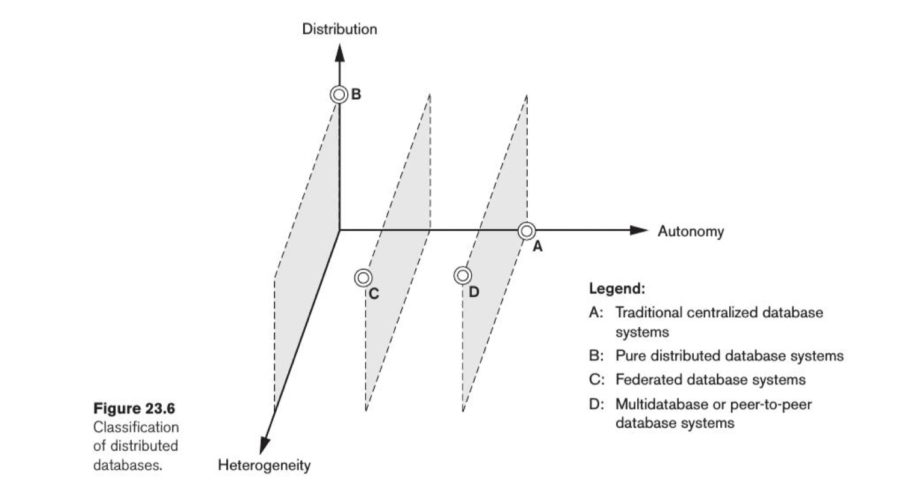

## Distribuidas

Una base de datos distribuida (DDB) es una colección de múltiples DBs, lógicamente relacionadas, pero distribuidas a travéz de una red de computadoras.

Además de proveer transparencia entre datos físicos y lógicos, como lo hacen los DBMS normales, debeen proveer transparencia de:
- Organización de los datos: dónde están ubicados físicamente los datos
- Fragmentación: Si los datos están repartidos usando fragmentación horizontal (por filas, también conocido como sharding) o vertical (por columnas, más común en una columnar DB).
- Replicación
- Diseño del sistema, y como se reliza ejecución de queries de forma distribuida

> Pensar que al ser distribuida la DB las fallas no solo son porque un nodo dejó de funcionar, sino también por perdida de mensajes en la red.

Visto lo anterior, se puede ver que el sistema debe proveer **transparencia total**.

Características deseables: Disponibilidad, escalabilidad (horizontal o vertical), tolerancia a pariticiones y autonomía (un nodo debe ser capaz de operar por si solo, aunque sea limitadamente).

La replicación de los datos puede ser parcial o total. Para cada data item vale que $1 \leq |copias| \leq |nodos|$. La elección de dónde replicar cada data item depende de múltiples factores.

Al haber múltiples copias de cada data item, el problema de control de concurrenecia se complejiza aún más. Variantes:
- Copia distinguida: Se designa una copia de cada di como la distinguida. Los `lock`/`unlock` son enviados a esta.
    - Sitio primario: Un único sitio es el distinguido, y este actúa como lock manager, orquestando quien tiene cada lock sobre un data item. También es el encargado de distribuir modificacionas a un di cuando un `write_lock` esta por ser liberado.
    - Sitio primario + backup: Existe otro sitio que en caso que falle el primario, toma el control. Relentiza más ya que hay que mantener consistencia en el estado de los locks entre primario y backup.
    - Copia primaria: En vez de ser un único nodo el coordinador de locks, una copia de cada data item es designada como primaria, y el nodo que la posea coordina los locks para dico di.

En todos los esquemas anteriores, ante la falla de uno o múltiples sitios, se puede iniciar un proceso de elección de un nuevo coordinador. Este se realiza por medio de pasaje de mensajes.

Otro esquema de control de concurrencia se conoce como **votación** y consisten en el pasaje de mensajes para pedir un lock, al cual cada dueño de una copia debe responder. Si hay mayoría se toma, sino se timeoutea.

Para asegurar ACID, se utilizan ténicas como [2-phase-commit (2PC)](https://www.youtube.com/watch?v=-_rdWB9hN1c&ab_channel=MartinKleppmann).

**Fragmentación y replicación**

Fragmentación: Repartir los datos entre diferentes servidores (+ write)
Replicación: Crear copias de los datos existentes entre diferentes servidores (+ read)

Un esquema común de replicación se conoce como master-slave. Un solo nodo (`master`) de la ddb puede recibir pedidos de lectura / escritura. Las escrituras se replican a los `slave`, los cuales pueden recibir pedidos de lectura. Si el master se cae, se elige uno nuevo (leader election).

La fragmentación consiste en dividir los datos entre múltiples servidores. Esto puede ser realizado de manera horizontal, vertical o mixta. 
La primera, horizontal, también es conocida como sharding. Esta permite facilmente a un sistema distribuido escalar de forma horizontal. Siempre se trata de que cada shard se encuentre balanceado (misma cantidad de data items en cada uno). En caso que esto no ocurra, se puede **rebalancear** los shards.

**Procesamiento distribuido**

> TODO: Revisar distributed query processing en libro, y ejemplos de ancho de banda consumido

**Taxonomía**

Los factores a tener en cuenta a la hora de clasificar las DDB son homogeneidad (si todos los server y usuarios utilizan el mismo software), y el nivel de autonomía local.

- DBs federadas: Hay múltiples nodos los cuales cada uno funciona como una DB en si (con algún grado de autonomía), pero exponen una **vista global** del sistema compuesto por todos estos nodos.
- Multidatabase system: Cada una de las bases de datos del sistema distribudo es **totalmente autonoma**, y no poseen un esquema global. Este es contruido a medida que es requerido por la aplicación que intereactúa con la ddb.

La dimensión de heterogeneidad puede surgir de diferencias en los modelos de datos, diferentes versiones de un mismo DBMS, o diferencias de sistema.

Otra clasificación que se puede realizar sobre las DDBs (o mejor decir DBMS que están compuestos por más de un nodo) es teniendo en cuenta la arquitectura (hw y datos). 
- Parallel dbms
    - shared memory and disk (shared-everything)
    - shared disk
    - shared nothing: En este caso parece que es una ddb, pero como son muchos core cada uno con su memoria principal y storage secundario, que comparten un bus de alta velocidad, no son considerados distribuidos.
- Distributed dbms

Un modelo arquitectónico para entender una ddb puede ser el siguiente:

- La vista que pueden ver los clientes de la ddb es **GCS**. Este provee la transparencia total necesaria para operar
- Para manejar la heterogeneidad entre los nodos, cada uno posee un **LIS**, el cual modela los detalles de organización física de los mismos
- Como también cada nodo puede tener heterogeneidad semántica, cada uno posee un **LCS**.

> TODO: Repasar del libro la parte de arquitecturas distribuida. En las diapos le falta

**Catalogos**

Una ddb debe exponer/mantener un catálogo que contiene metadata acerca de ella. Guarda cosas como distribución de los data item / replicas de los mismos, etc. Puede ser administrado de las siguientes formas:
- Centralizado
- Totalmente replicado
- Parcialmente replicado (fragmentado + cachin en cada nodo de lo que no le pertenezca)