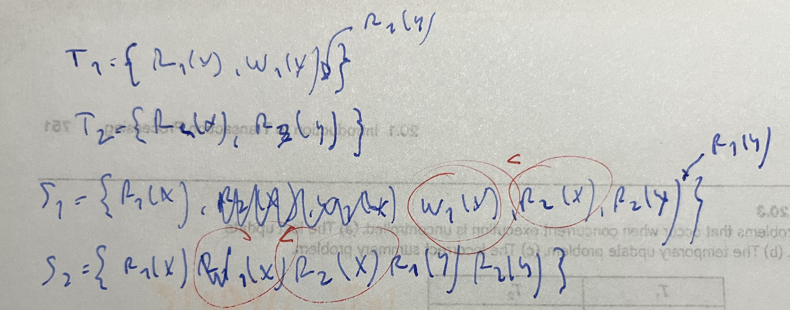
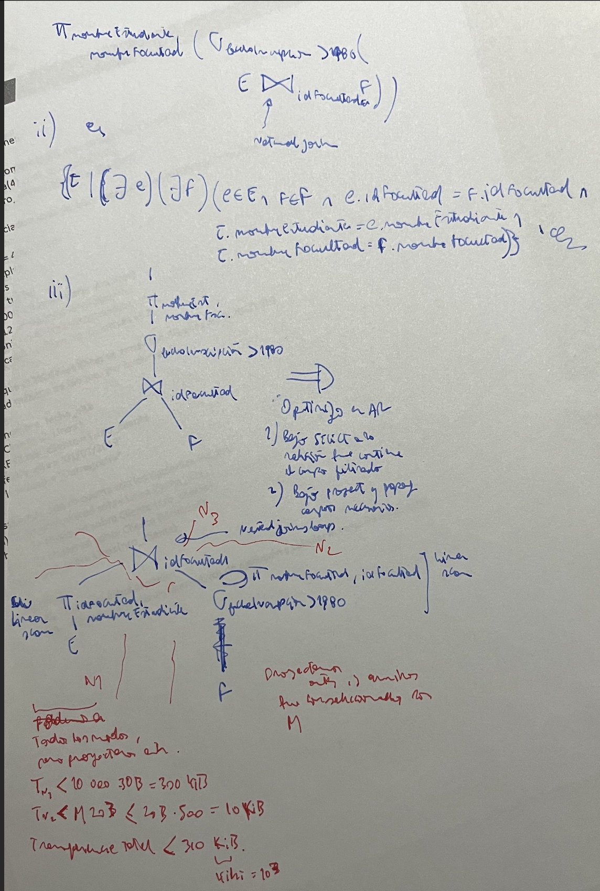
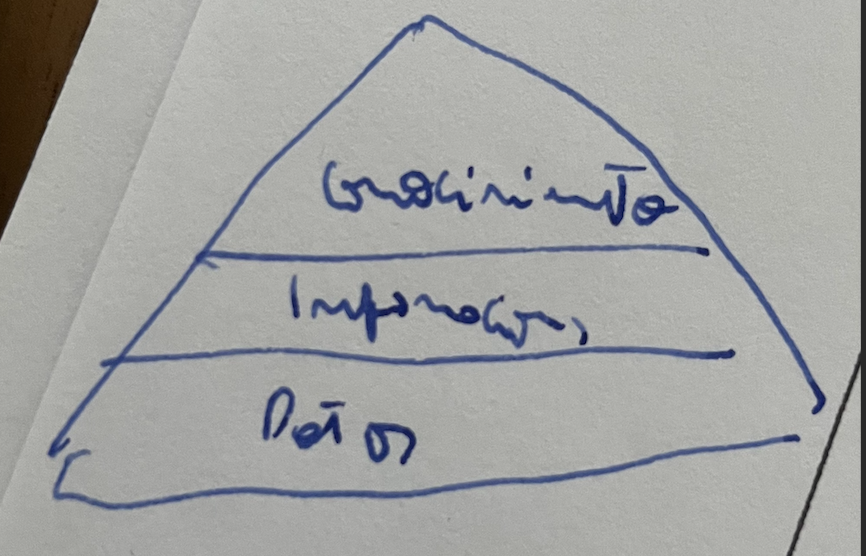
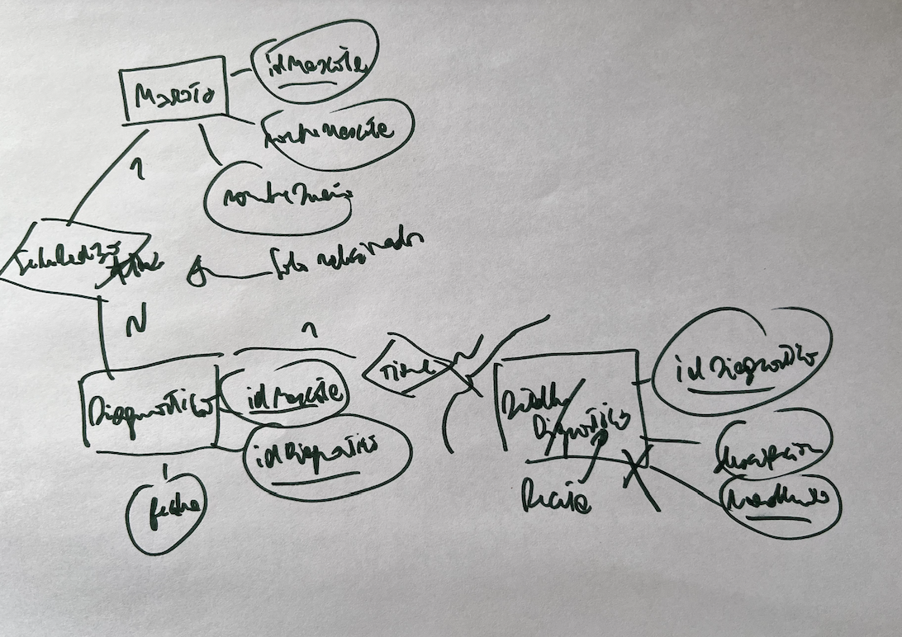
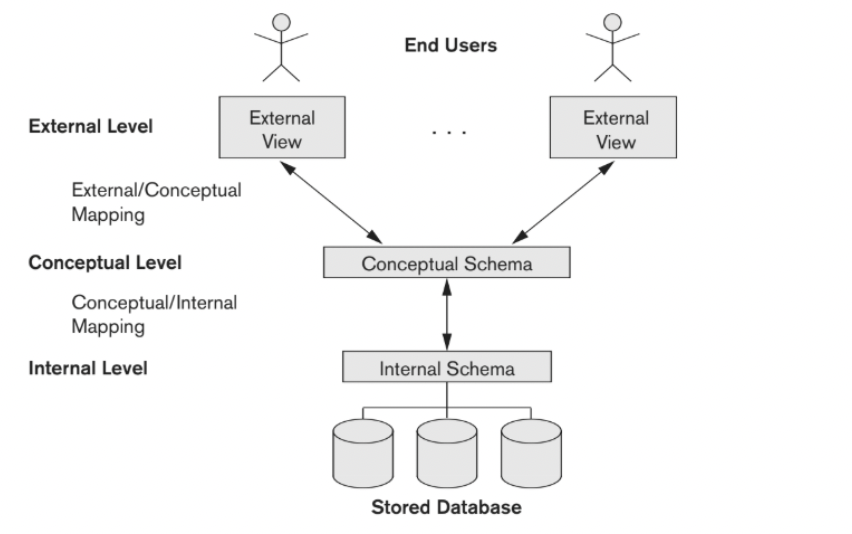

## Julio 2022

- <span style="color:green">Qué parte del DBMS se encarga de garantizar aislamiento</span>

En un DBMS, llamamos aislamiento (isolation) a la propiedad que dos transacciones que son ejecutadas simultaneamnete no interfieran entre si. El componente encargado de esto es el subsistema de control de concurrencia. Realiza esta tarea controlando el acceso de las transacciones a los múltiples data items que forman una DB.

- <span style="color:green">Modelás una biblioteca con un DER, dar una interrelación 1-n y una n-m</span>


- <span style="color:red">Te daba una query en sql y había que escribirla en ar, dar el árbol canónico, dar 2 planes de ejecución y decir creo que una optimización que se pueda hacer si se tienen estadísticas sobre los datos</span>
- <span style="color:green">Para qué sirve el logging y explicar undo/redo</span>

Logging es un mecanismo que sirve para, al ocurrir una falla no catastrófica en el DBMS, poder recuperar el estado de la base de datos que maneja a uno consistente. Esto consiste en que las transacciones que son ejecutadas, aparte de afectar tanto la base de datos en disco como la parte en memoria de la misma (que se encuentra en el buffer, o cacheada), crean un registro en un archivo write-ahead por cada operación de escritura que realizan. De esta forma, y con diversos mecanismos, se puede recuperar el estado a uno consistente con respecto a qué transacciones fueron commiteadas y cuáles no.

Undo/redo es uno de estos mecanismos, el cual aparte caracteriza de qué forma maneja los commit el cache manager. En este caso, se dice que es:
- Steal: Permite que se bajen a disco escrituras en bloques, cuya transacción no fue commiteada. Esto permite que se reutilice espacio en el buffer en memoria principal.
- No Force: Cuando una transacción se commitea, no hace falta que todas las modificaciones de la misma sean escritas en disca en el acto. Esto hace que si ocurren sucesivas modificaciones sobre un data item, ahorrar tráfico de IO.

Estas dos características hace que durante el recovery, haya que tanto re-hace (REDO) operaciones que fueron commiteadas, pero no escritas en disco (por no-force); y des-hacer escrituras en disco de transacciones que no hayan commiteado (UNDO). Por eso, ante cada write, una transacción debe escribir en el log una entrada con la siguiente forma:
```
(write_item, transaction_id, data_item_id, value_before, value_after)
```

De esta forma, al ocurrir una falla (asumiendo que hubo un checkpoint previamente), se procede de la siguiente manera:
```
commited_txs = transacciones commiteadas desde el último checkpoint, es decir que se encuentre después del checkpoint una entrada `COMMIT tx_i`
active_txs = transacciones activas desde el último checkpoint, es decir que estaban en el checkpoint como activas y no commitearon, o que empezaron y no commitearon

// UNDO
for (write_item, tx, X, before, after) leyendo desde adelante para atras:
    if tx in active_txs:
        write(X, before)

for (write_item, tx, X, before, after) leyendo desde atras para adelante:
    if tx in commited_txs:
        write(X, after)

cancelar y re-submittear tx in active_txs
```

- <span style="color:green">Qué es falsa sumarización y qué nivel de aislamiento se necesita en sql para evitarlas</span>


Falsa sumarización es un problema que surge cuando una transacción realiza algun tipo de agregación sobre data items (sumarización) y otra afecta alguno/s de ellos, siendo esta modificación no incliuida en la sumarización.

Se necesita el nivel de aislamiento SERIALIZABLE para que no ocurra este tipo de errores.

> Quoting [SQL server docs](https://docs.microsoft.com/en-us/sql/t-sql/statements/set-transaction-isolation-level-transact-sql?view=sql-server-ver16): Range locks are placed in the range of key values that match the search conditions of each statement executed in a transaction. This blocks other transactions from updating or inserting any rows that would qualify for any of the statements executed by the current transaction.

- <span style="color:green">Que es árbol de decisión y dar un ejemplo</span>

Los árboles de decisión una una técnica utilizada en data mining. Forman parte de lo que es llamado el aprendizaje supervisado, que apunta a resolver problemas de clasificación/descubrimiento/inferencia teniendo como entrada datos previamente clasificados.

En este caso, los árboles de decisión trabajan construyendo un árbol que en cada nivel toma una decisión con respecto a los atributos del dato de entrada, lleganod a una decisión con respecto a la clasificación para la que fue entrando en las hojas.

Un ejemplo para saber si comprar un auto o no podría ser:


- <span style="color:yellow">Que dice el teorema CAP y relacionarlo con ACID</span>

El teorema CAP es un teorema enunciado sobre los sistemas distribuidos. El mismo enuncia que de las siguientes 3 propiedades de un sistema distribuido:
- Consistencia
- Availability (disponibilidad)
- Tolearncia a particiones (partition tolearance)
Solo dos pueden ser garantizadas a la vez. También, teniendo un sistema distribuido como una base de datos que sabes que tiene que ser tolerante a particiones (de otra forma no tendría sentido que tenga múltiples nodos ya que son inevitables) solo es posible asegurar C o A.

ACID hace respecto un conjunto de propiedes que son deseables de un sistema transaccional con el cual interactua un usuario (como lo es una base de datos relacional). Generalmente, el mismo es pensado para una BD no distribuida, es decir, que tiene un solo nodo con el cual el usuario interactúa directamente. 

Las bases de datos tienen otro conjunto de propiedades llamado BASE, el cual caracteriza como es la interacción de un usuario con ellas. Este es:
- Basic Availability
- Soft State
- Eventual Consistency

<mark>TODO: Esta bien esto?</mark>

- <span style="color:green">Por qué en NoSQL se necesita la consistencia eventual</span>

Un caso de uso muy común de bases de datos NoSQL, es en web services de gran escala, los cuales comunmente son distribuidos. De esta forma, y al corresponder a un sistema compuesto por muchos nodos comunicados entre si por Internet (o algun tipo de red de computadoras), entra en juego el teorema CAP. El mismo dice que de las tres propiedades que enuncia, solo dos pueden ser válidas. Particion a tolerancia es un requisito obligatorio, ya que de otra forma si un nodo no fuera alcanzable (ya sea por una falla de red o en el mismo, lo cual ocurre muy a menudo a la escala en la que estos sistemas suelen usarse) el sistema se tornaría inutilizable. 
De estas dos, por el teorema CAP, solo nos queda garantizar disponibilidad o consistencia. Como usualmente los servicios que consumen estas DBs sirven usuarios finales, los cuales esperan una respuesta en tiempo acorde, disponibiblidad es la propiedad más frecuentemente elegida. Ya que aparte, la solución consiste generalmente en relajar la definición de consistencia, dando paso a la consistencia eventual.

La misma dice que el sistema no tiene que ser perfectamente consistente (que al ejecutar un READ, el valor respondido corresponda al del WRITE más reciente), sino que es admisible que en algún momento en el futuro el cambio se vea reflejado en todo nodo. Es decir, que **eventualmente** sea consistente.

- <span style="color:green">Qué es open data y sus características principales</span>

Se llama Open Data a la disponibilización de datos gubernamentales por parte del estado, a travez de internet, de forma de promover su análisis y re-utilización.

Las caracterísiticas principales de los mismos son:
- Que sean procesables por computadoras, es decir, un formate fácil de parsear y semi-estructurado por lo menos
- Sin licencia
- Totalmente abiertos, sin necesidad de registro
- Tener la menor alteración posible, y sean proveídos lo más cercano a su fuente posible
- Completos
- Compartidos en tiempo, sin retrasos a la fecha de los datos mismos

- <span style="color:green">**Qué es gobierno de datos y su relación con calidad de datos**</span>

Gobierno de datos se llama la desarrollo de técnicas, arquitectures y procedimientos para el manejo de datos dentro de una organización, como puede ser una empresa, gobierno, universidad, etc. Incluye aspectos de como se tratan los datos, como se almacenan y protejen. Como estás técnicas se diseñan e implementan con el fin de proteger los datos de las malas prácticas, de esta manera haciendo más valiosos ya que pueden ser explotados para la extracción de información, se dice que es escencial para asegurar la calidad de los datos.

- <span style="color:green">**Diferencia entre datos estructurados y datos semi-estructurados**</span>

Los datos estructurados son aquelos que fueron formateados y trasformados de forma de encajar en un modelo bien definido. Tienen campos pre-definidos los cuales poseen un nombre y tipo de datos. Por ejemplo, los datos que son almacenados en DBs relacionales son estructurados.

A diferencia de estos, los semiestructurados fueron transformados para acatar a un formato standard de forma de ser fácilmente parseados por un programa, pero carecen de la estructura que les da un modelo bien definido. A pesar de esto, se caracterizan por ser más flexibles y son muy usados en la industria para representar meta-información sobre alguna entidad, o atributos variables.

- <span style="color:green">Tipos de fragmentación que puede haber en una base distribuida y dar ejemplos</span>.

Fragmentar consiste en particionar los datos de una DB, a travéz de mútiples nodos que forman parte de la misma. De esta forma, se puede repartir la carga de almacenamiento entre todos, y escalar más fácilmente. Tomemeos como ejemplo una relación `Empleado(id, nombre, apellido, dirección, organizacion_id, manager_id, ...)` Hay 3 tipos de fragmentación

- Horizontal: Consiste en particionar las tuplas (o entradas) dentro de una relación entre múltiples nodos. Se utiliza un criterio fijo para realizar la fragmentación, ya que el mismo debe ser utilizado para insertar, modificar y buscar instancias en particulares. Por ejemplo, en nuestra relación `Empleado` podría ser por `organización_id`. De esta forma cada nodo tendría los empleados de algunas de las organizaciones. También es conocido como sharding.
- Vertical: Consisten en partir la relación en conjuntos de atributos, cada una asignada a un nodo, y almacenar en cada uno la porción de todas las tuplas que le corresponda. Notar que aquí hace falta guardar también la PK en cada una para poder reconstruir la relación entera. Un ejemplo sería guardar en un nodo la info. personal del empleado `[id, nombre, apellido, dirección]` y en otro la info de laboral `org_id, manager_id, ....`.
- Mixto: Consiste en mezclar los dos anteriores.

- <span style="color:green">**Qué es una ontología y dar un ejemplo**</span>

El estudio de ontologías trata de describir los conceptos y relaciones que son posibles en algún dominio por medio de un vocalubario común. Una ontología esta compuesta por una conceptualización que el conjunto de conceptos y relaciones entre ellos que son parte del dominio de nuestro interés, y un lenguaje y vocabulario definido para poder especificar estas conceptualizaciones.

Por ejemplo imaginemos que definimos una ontología sobre pizzas. Definimos un concepto o clase de **Pizza**, y otra **Pizza vegetariana** que es una Pizza también, pero no tiene ingredientes que correspondan a la clase **Carne**. Ahora si creamos una instancia de Pizza que no posee ingredientes carnivoros, mediante la ontología se puede inferir que esta es una Pizza vegetariana.

Otro ejemplo que es una trabajo en curso es la Web Semántica, que trata de definir una ontología compartida por todas computadoras de la Internet para facilitar el intercambio de información.

## Agosto 2022

- <span style="color:green">**¿Qué son las propiedades BASE? ¿Qué relación tienen con las ACID?**</span>
Un conjunto de propiedades con las cuales se pueden caracterizar la interacción de un usuario con una ddb. 
- basic availability
- soft state
- eventual consistency

ACID son propiedades que puede garantizar una DBMS relacional típica, la cual esta compuesta por un solo nodo. Estas sos más "fuertes" que lo que garantiza BASE, a pesar de ser pensadas para un sistema diferente. Por eso, base toma algunas de las propiedades de ACID (por ejemplo la consistencia), y las relaja para volverlas garantizables considerando limitaciones de las ddb, y límites teóricos como lo es el teorema CAP.

- <span style="color:green">**¿Qué es una transacción? ¿Qué significa que una transacción lea de otra? Definir dirty read y dar ejemplo.**</span>

Una transacción es un conjunto de operaciones sobre la DB, las cuales el DBMS se consideran como una unidad lógica de procesamiento, la cual debe ser ejectuada de forma atómica por el DBMS.

Para mejorar la performance de la base de datos, estas suelen ser ejecutadas concurrentemente, es decir, de forma entrelazada. Por ejemplo, si una transacción T1 está compuesta de ${(READ_1(X), X \leftarrow X+1, WRITE_1(X), COMMIT_1)}$, y otra T2 de ${(READ_2(X), X \leftarrow X-2, WRITE_2(X), ..., ABORT_2)}$, un posible orden de ejecución sería:

$READ_2(X), X \leftarrow X-2, WRITE_2(X), READ_1(X), X \leftarrow X+1, WRITE_1(X), ...$

En este caso, dos cosas ocurrieron:
- $T_1$ lee X, pero no cualquier X, sino un X que fue actualizado por la otra transacción $T_2$. Esto se lee como $T1$ lee de $T2$, ya que lee un valor producido por la segunda.
- Notar que al final de su ejecución, la transacción $T_2$ aborta, dejando a la transacción $T_1$ con un valor que no debería haber existido, ya que abortar significa que la transacción va a ser revertida como si nunca hubiera ocurrido. Esta situación se llama **dirty read**, ya que $T_1$ leyó un valor que no era parte de un estado consistente de la db.

- <span style="color:green">**¿Qué diferencia hay entre bases distribuídas que usa copia distinguida de sitio primario y de copia primaria? Dar ventajas y desventajas de ambas.**</span>

Clasificar una base de datos distribuida entre sitio primario, o copia primaria, son dos sabores del mecanismo de control de concurrencia que la misma utiliza, llamado copia distinguida. El mismo especifica que "alguien" realiza el control de acceso sobre un data item, es decir conceder o no un write_lock, o un read_lock.

En el caso de sitio primario, un nodo de la ddb es designado como sitio primario, y este maneja el control sobre los locks de todos los data item. De este modo, todo el que quiera poder leer / escribir cualquier data item, debe pedirle acceso a un único nodo. Esto hace que distribuir la db sea de fácil implementación, ya que el manejo de concurrencia sigue siendo centralizado. Por otro lado, se torna un cuello de botella ya que un úncio nodo debe procesar los pedidos de todos los otros (aparte de él mismo); y además es un punto úncio de fallo, de forma que si el "sitio primario" deja de funcionar, o sufre una desconexión de la red, ningún otro nodo puede solicitar locks.

El otro enfoque, copia primaria, distribuye esta resonsabilidad. Para cada data item, un único nodo es designado como el responable de manejar los locks de este, pero no necesariamnete el mismo. Por ejemplo para el registro `X`, el nodo `A` puede ser la copia primaria, mientras que para `Y` sea `B`. De esta forma ya no hay un único punto de falla, y deja de ser un cuello de botella porque la responsabilidad está distribuida. A pesar de esto, la implementación es mucho más compleja.

- <span style="color:green">**¿Qué es una historia y cuándo dos historias son equivalentes en conflicto?**</span>

Una historia o schedule es una forma de ordernar las operaciones de un conjunto de transacciones, de forma de poder ejectuarlas concurrentemente. Formalmente, es un orden parcial o total, definido sobre las operaciones de un conjunto de transacciones $T_i$, con $i \in \{1, ..., n\}$. Este orden define como es la secuencia de operaciones de una transacción que son ejecutadas. Por ejemplo si $read_1(X) < write_2(Y)$ eso quiere decir que la lectura se ejecuta antes de la escritura. En cambio, si es un menor o igual, esto índica que pueden ser ejectuadas concurrentemente.

Ahora, tenemos múltiples historias que pueden ser definidas para un mismo conjunto de transacciones. Una forma de ver si son equivalentes (llevan la base de datos al mismo estado final) es mediante el concepto de equivalencia en conflicto. Primerdo, decimos que dos operaciones estan enconflico cuando las dos pertencen a transacciones diferentes, actual sobre el mismo data item, y al menos una de ellas es un write. Ahora, dos historias $s_1$ y $s_2$ son equivalente en conflicto, si cada par de operaciones en conflicto tienen el mismo orden relativo en ambas historias.



## Marzo 2020

- <span style="color:red">**Qué es una base de datos distribuida. Describir el protocolo 3PC.**</span>
- <span style="color:green">**Ejercicio optimización**</span>
```
Tenés 2 relaciones E = {idEstudiante, nombreEstudiante, idFacultad, fechaInscripción} y F = {idFacultad, nombreFacultad}. Los registros de E miden 30 B, y hay 10.000 de ellos. Los registros de F miden 20 B y hay 500 de ellos. Hay 3 nodos N1, N2 y N3. N1 tiene a E, N2 tiene a F, y N3 hace la query 'Devolver id de estudiante y nombre de la facultad de los estudiantes que se inscribieron después de 1980'.

i) ¿Que agregarías a la BD para capturar la siguiente situación: 'un estudiante puede inscribirse a varias facultades, pero en fechas distintas'?
ii) Escribir la query en AR y en CR
iii) Describir una estrategia de resolución de la query, junto con cuantos bytes son transferidos. Reemplace por variables las cantidades desconocidas (con eso se refiere a que no sabés cuantos estudiantes se inscribieron después de 1980, y que tendrías que reemplazar dicha cantidad por una variable).
```




## Febrero 2020
- <span style="color:green">**Definir superclave, clave primaria y dependencia funcional.**</span>

Sea una relación $R(A_1, A_2, ...., A_n)$ con n atributos:
- Superclave: Es un conjunto $S \subseteq \{A_1, A_2, ..., A_n\}$ tal que si para dos tuplas $t_1$ y $t_2$, se cumple que $\forall s \in S, s(t_1) = s(t_2)$ entonces $t_1 = t_2$. Es decir, los atributos que forman la superclave identifican unívocamente una tupla, de ahí el nombre de clave.
- Clave primaria: Una clave primaria es una superclave que es minimal, es decir que si se le quita uno de sus atribrutos deja de ser superclave, y que es elegida como la clave principal para identificar las tuplas de una relación.
- Dependencia funcional: Es una propiedad semántica de una relación y del modelo en si. Se notan como $X \rightarrow Y$, con X,Y atributos o conjuntos de atributos de R. Quiere decir que los valores que tomas $Y$ en cada tupla de la relación dependen de los que tomen $X$. Por ejemplo, en una relación $Persona(dni, nombre, apellido, telefono)$, se cumple que $dni \rightarrow nombre,apellido,telefono$ ya que la presona es identificada unívocamente por el dni.

- <span style="color:green">**¿Qué es gobierno de datos? Diferencias entre datos, información y conocimiento.**</span>

El gobierno de datos consiste en el desarrollo de técnicas, procedimientos y arquitecturas para manejar adecuadamente datos de una organización, de forma de asegurar el nivel de calidad requerido. Notar que no es solo un tema de sistemas, sino organizacional.

Un dato es la forma más en crudo de las observaciones que se toman sobre algun evento, u objeto del mundo real. También puede ser un conjunto de transacciones (no en el sentido de DBMS), sino de movimiento/intercambio de activos, los cuales no son entidades del mundo real. En si mismo, un dato en crudo no tiene significado o razón de ser.
La información es un conjunto de datos procesados con significado y propósito.
El conocimiento vendría a ser el "destialdo" de la información. Consiste en los aprendizajes obtenidos de procesar información, y adquirir resultadods útiles para tomar alguna acción.



- <span style="color:green">**¿Qué es Data Mining? Describir las distintas técnicas.**</span>

Data mining consiste en el proceso de extración de patrones o información interesante (no trivial) de grandes volumenes de datos. Las técnicas que se usan se dividen en dos grandes grupos:
- Supervisadas, en los cuales se utilizan datos de entrenamiento anotados con la respuesta esperada. Estos actúan como un oráculo con el cual la técnica usa para guiar el aprendizaje de patrones.
    - Redes neuronales
    - Árboles de decisión
    - Regresión lineal
- No supervisada, en esta no se tienen datos anotados como entrada. El objetivo es poder encontrar la estructura oculta de datos no clasificados.
    - Clustering


## Noviembre 2019

- <span style="color:green">**Definir transacciones y dar y explicar las propiedades ACID.**</span>
transacción es un conjunto de consultas que representan unidad básica de ejecución y atomicas. atomicity, consisten preservation, isolation y durability

- <span style="color:green">**Definir clave candidata. Definir clave primaria. Cuando un esquema está en 2FN?**</span>
conjunto de atributos que identifican univocamnete una tupla. que no haya un atributo que dependa de parte de la pk. debe ser fully dependant de la pk

- <span style="color:green">**Definir dependencia funcional. ¿Para qué sirve que la normalización? ¿Cómo esta relacionado con la calidad de un diseño de bases de datos? ¿Qué problemas puede presentar una base desnormalizada? Ejemplifique**</span>

df propiedad semantica que los valores que toma conj. de atributos depende de otro conjunto. normalización es el proceso para llevar el modelo a una forma mayor en la que esta, separando relaciones de forma que mantengan la infroacion, y siguen valiendo las dfs. Se hace basado en la PK y el conjunto de dfs.

problemas: greenundancia de infromacion, y anomalias:
- insercion: insertar un empleado y tener que agregar el nombre del dto donde trabaja, y tiene que ser consistente con el resto
- actualizacion: actualizar nombre depeto
- eliminacion: borrar ultimo empleado de un dto y perder toda la info de ese dto

- <span style="color:green">**Dada la siguiente relación (idEstudiante, nombreEstudiante, nroCurso, idProfesor). En base a su conocimiento del dominio, detalle cuales son las dependencias funcionales en ese esquema. ¿Está en 3FN? Justifique. En caso de no estarlo dar una descomposición que sea 3FN.**</span>

dfs:
1. idEstudiante -> nombreEstudiante, nroCurso
2. nroCusto -> idProfesor

no esta en 3fn, ya que existe un df transitiva entre un atributo no clave (idProfesor) y otro si (idEstudainte)
Descomposicion:
```
Estudiante(idEstudiante, nombreEstudiante, nroCurso)
DictadaPor(nroCurso, idProfesor)
```

- <span style="color:green">**Defina bases de datos distribuida. Qué nuevos niveles de transparencia aparecen junto a estas bases?**</span>

base de datos que esta compuesto por multiples nodos, comunicados entre si a travez de una green de computadoras. transparencia total? que el usuario interactua con la misma como si fuera un úncio sistemas, más alla que este compuesto por multiples nodos.

transparencia:
- organización de los datos
    - ubicación
    - nombres
- fragmentación
- replicación
- ejecución

- <span style="color:green">**No me acuerdo exactamente el enunciado, pero era asi: Tenias dos tablas: Estudiantes E: (idEstudiante, nombreEstudiante, idFacultad, fechaNac), Facultad F: (idFacultad, nombreFacultad, region). Un estudiante va a 1 y solo 1 facultad. La tabla Estudiantes tiene 10000 registros de 30 bytes cada uno. La tabla universidad tiene 100 regitros de 20 bytes cada uno. Suponga una base de datos distribuida de 3 nodos N1, N2 y N3 donde N1 tiene la tabla estudiantes, N2 tiene la tabla universidades y N3 no tiene nada.**</span>
    - <span style="color:green">**Expresar en álgebra relacional la consulta: “devolver id de estudiante y nombre de la facultad para los estudiantes que hayan nacido despues de 1980”**</span>
    - <span style="color:green">**Dar dos estrategias de resolución de esta query, indicando cuantos bytes se transfieren por la green entre las maquinas. Por ejemplo “N1 y N2 mandan todo a N3”**</span>
    Aca las dos estrategias cambia donde se reaiza el join, si:
        - n2 le pasa la data a n3, se hace el join ahi y se pasa la data joineada
        - n3 le pasa la data a n2, y se pasa la data joineada a n1
        - n3 y n2 le pasan la data a n1, y ahi se realiza el join
    - <span style="color:green">**Esta no me la acuerdo mucho pero era algo como “de forma general, cual es la estrategia óptima?”**</span>
        - dependeniendo de lo de arriba nomas, ya que para una ddb lo mas costoso es el trafico de green, el resto es de ordenes de magnitud menor

- <span style="color:green">**(Creo que este era exactamente el enunciado, con un 90% de seguridad): Se tienen 4 servidores N1, N2, N3 y N4, y 4 regiones reg1, reg2, reg3, reg4 tal que cada servidor Ni está en la región regi.**</span>
    - <span style="color:green">**Indicar como sería la query en algebra relacional que fragmentaría a la tabla Facultades del insiso anterior para que cada facultad vaya al server de su región (todas las facultades pertenecen a una y solo una de esas 4 regiones) y la query que fragmente a la tabla Estudiantes por la region a la que pertenece su facultad.**</span>
    Para un nodo_i, ubicado en la region_i

    $\sigma_{region=region_i}(Facultad)$

    $\pi_{idEstudiante,nombreEstudiante,idFacultad,fechaNac,region}(\sigma_{region=region_i}(Facultad \Join Estudiante))$

    Notar que el join de arriba es un natural join, por lo cual se hará por $idFacultad$

    - <span style="color:green">**Qué tipo de fragmentación utilizó?**</span>

    Horizontal, ya que se fragmentaron (repartieron) las tuplas de las relaciones F y E entre los nodos. También es llamado sharding.
    - <span style="color:green">**Indicar en algebra relacional como sería la query que reconstruya las tablas originales**</span>

    $\cup_{i \in \{1,2,3,4\} (Facultad_i)}$
    $\cup_{i \in \{1,2,3,4\} (Estudiante_i)}$

    Asumiento que $Relacion_i$ es el fragmento de la relacion $Relacion$ en el i-esimo nodo. El operador es union.
- <span style="color:green">**Dar 2 heuristicas que use el optimizador de consultas. Ejemplifique.**</span>
    - bajar los SELECT lo más cerca posible de cada relacion
    - Un select conjuntivo se puede partir en un pipeline, y de esta forma bajarlos a donde corresponda
    - bajar el project lo más cerca de las relaciones, y si pasa por un join en el medio agregar el atributo joineado

## Noviembre 2019
- <span style="color:red">**¿Qué es fragmentación mixta? Dar un ejemplo, con una query en álgebra relacional para reconstruir las tablas originales**</span>

Ver reconstrucción [aca](./distribuidas.md#fragmentacion-detalles)

- <span style="color:green">**Explicar bases NoSQL por documentos, explicando el concepto de documento. Mostrar cómo sería una base por documentos para el ejercicio anterior (no sé si había que hacer el DID, poner los jsons o ambos).**</span>
```
Tenías tres relaciones y había que dar según conocimiento del dominio las dependencias funcionales y decir en qué FN estaba (idMascota, nombreMascota, nombreDuenio), (idMascota, idDiagnostico, fecha), (idDiagnostico, descripcion, medicamento). (No había una única respuesta).
```



- <span style="color:red">**¿Cuáles son las dos formas de interrelación/interoperabilidad de datos? (creo que era integración e intercambio).**</span>
<mark>TODO: respondeme</mark>

- <span style="color:red">**Describir el protocolo 3PC.**</span>

[Muy buena explicación de 3pc](https://courses.cs.vt.edu/~cs5204/fall00/distributedDBMS/sreenu/3pc.html#fail)

## Popurri



- <span style="color:green">**Explicar independencia lógica**</span>

La independencia lógica es la capacidad de cambiars el esquema conceptual, si afectar los esquemas externos. De esta manera, uno puede cambiar la el modelo lógico que se utiliza en la base de datos, si after la forma en que los usuarios la consumen, ya qu estos dos estan disociados, y mantienen un mapeo que lleva a cabo al traducción entre uno y otro.

- <span style="color:green">**Explicar independencia física**</span>

La independencia lógica es la capacidad de poder cambiar el esquema interno (físico, acoplados al motor del DBMS) sin afectar el esquma interno. Como hay un componente encarado de realizar el mapping entre estos (por ejemplo, ya que se expresan en un lenguaje común como SQL, interpretado por múltiples DBMS). Algunos ejemplos de cambios de esquema interno son cambios en la configuración del engine, agregado de índices, etc.

- <span style="color:green">**Diferencia entre administrador de datos y DBA. Relacionar con concepto de independencia física y transparencia.**</span>

Un DBA es un especialista en un motor de DB, por ejemplo Oracle, MySQL, etc. Su expertise se encuentra en el mantenimiento de la misma, y el manejo de los lenguajes de consulta. Por otro lado, un administrador de datos se encargar de los datos de la organización en si, dónde se producen, y su manejo interno.

- <span style="color:green">**Que es dataware housing?**</span>

Un data warehous es una colección de datos armada para guiar la toma de decisiones de negocio de una organización. Proveen acceso a queries complejas, descubrimiento de conocimiento y soportes a demandas de alta performance. Algunas características que suelen proveer son: integrado, no volatil, time variant (cada dato corresponde a un momento en el timepo)

La inserción de datos a un data warehouse suele hacerse mediante un proceso conocido como ETL: Extract transform load

- <span style="color:green">**Explicar bases NoSQL por documentos, explicando el concepto de documento. Qué es un DID? Dar un ejemplo de un sistema de base de datos por documentos.**</span>

Una documento es un tipo de datos semi-estructurado. El mismo suele almacenar información acerca de un objecto en particular, y su metadata. Esta último porción suele tener algun tipo de estructura común conocida por el dbms que permite optimizar quieries por medo de índices. Los documentos suelen ser expresados como una colección de pares clave valor, que puede tomar desde tipos de datos atómcios, hasta más complejos como otros documentos. Algunos formatos muy comunes que son documetnos son json y xml. Un base de datos NoSQL es un tipo de bases de datos no relacion, que almacena documentos. 
DID: Diagrama de interrelación de documentos. Incrustar o referenciar.